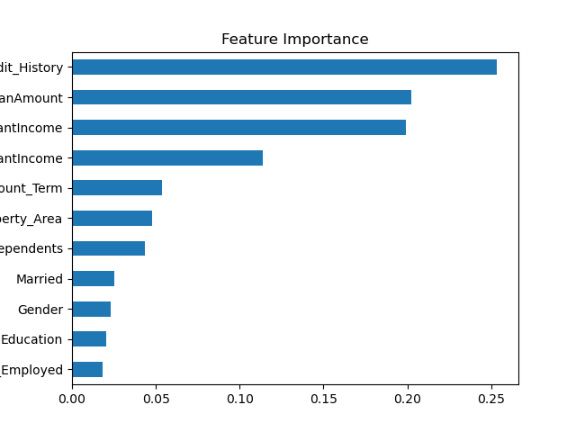

# 🏦 Loan Approval Predictor Pro

> **An end-to-end Machine Learning web app that predicts loan eligibility with explainable AI and advanced feature engineering.**

---

## 📌 Live Demo
👉 **[Click here to try the app](https://loan-approval-prediction.streamlit.app/)** 👈

---

## 📸 Screenshots

| Prediction UI | Feature Importance Dashboard |
| :---: | :---: |
|  |  |

*(Replace `images/homepage.png` and `images/feature_importance.png` with your actual screenshot paths).*

---

## 🎯 Business Problem

In the banking sector, **manual loan approval** is time-consuming and prone to human bias. This application provides an **AI-driven underwriting system** that predicts loan eligibility in seconds, helping banks:

- Reduce processing time by **80%**.
- Minimize default risk using **data-driven insights**.
- Ensure **fair and consistent** decision-making.

---

## 🔧 Key Features

- **🔮 Real-time Prediction:** Get instant results with a percentage confidence score.
- **📊 Advanced Feature Engineering:** Calculates `Total Income`, `Monthly EMI`, and `Debt-to-Income Ratio` to match real-world underwriting standards.
- **📈 Model Explainability:** Visualizes top factors driving loan approval (Feature Importance Chart).
- **🎯 Performance Metrics:** Displays Model Accuracy and Confusion Matrix for transparency.
- **🎨 Dark Glassmorphism UI:** Built with custom CSS to look like a premium fintech dashboard.

---

## 🛠️ Tech Stack

| Category | Tools |
| :--- | :--- |
| **Language** | Python 3.10+ |
| **Web Framework** | Streamlit |
| **Machine Learning** | Scikit-learn (Random Forest) |
| **Data Processing** | Pandas, NumPy |
| **Visualization** | Matplotlib, Seaborn |
| **Deployment** | Streamlit Cloud |

---

## 🧠 Model & Feature Engineering

### Algorithm: **Random Forest Classifier**
Chosen for its ability to handle non-linear relationships and provide feature importance scores.

### Engineered Features (The Secret Sauce):
- **Total Income:** `Applicant Income + Coapplicant Income`.
- **Monthly EMI:** `Loan Amount / Loan Term`.
- **Debt-to-Income Ratio:** `EMI / Total Income`. Lower ratio = Higher approval chance.

### Model Workflow:
1. **Data Cleaning:** Handled missing values using median/mode imputation.
2. **Encoding:** Used `LabelEncoder` for categorical variables (Gender, Married, Education, etc.).
3. **Feature Engineering:** Created `Total_Income`, `EMI`, `Debt_to_Income_Ratio`.
4. **Train-Test Split:** 80-20 split for evaluation.
5. **Training:** Random Forest with 150 estimators.
6. **Evaluation:** Achieved **~81% accuracy** on the test set.

---

